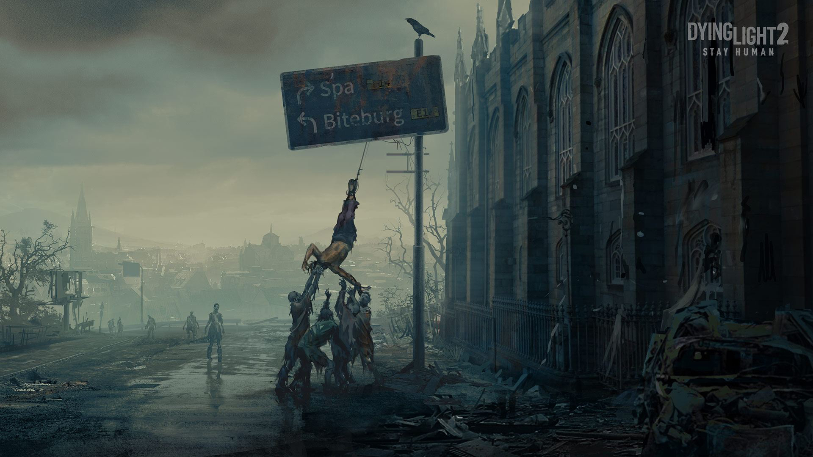

# 接受现实，努力生活

## 认清真相依然保持热爱
世界从不在乎你有多努力，它只关注你取得了多大的成就。

人生就像一场赌局，有人赢得满堂彩，有人输得血本无归。

梦想是美好的，但大多数人终将被现实的残酷击败。

现实从不心软，它会无情地揭示你的弱点和不足。

你的价值取决于市场的需求，而不是你个人的努力。

好运永远只是个别人的故事，大多数人只能靠努力去争取微小的机会。

时间不会等待任何人，它会毫不留情地将你拋在身后。

成功往往是少数人的游戏，大多数人只能买个门票去观望。

世界并不公平，优胜劣汰是它的底线规则。

没有人会在乎你的失败，他们只关心你的成功能给他们带来什么。

 